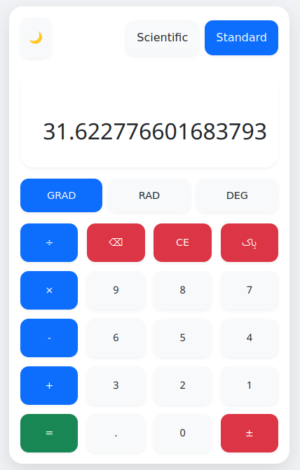

# 🧮 Advanced Scientific Calculator

<div align="center">


[](LICENSE)
[](https://github.com/Nightland4509)

[](#features)

**A beautiful, responsive scientific calculator with advanced mathematical functions and multilingual support.**

[🌐 Live Demo](#) | [📝 Documentation](#documentation) | [🚀 Features](#features) | [📥 Installation](#installation)

</div>

---

## ✨ Features

### 📊 Mathematical Functions
- **Basic Operations**
  - Addition, subtraction, multiplication, division
  - Percentage calculations
  - Positive/negative toggle

- **Scientific Operations**
  ```math
  sin(x), cos(x), tan(x)
  sinh(x), cosh(x), tanh(x)
  log(x), ln(x), x^y, √x, ∛x
  ```

- **Special Functions**
  - Factorial (n!)
  - Absolute value |x|
  - Mathematical constants (π, e)

### 🎯 Unique Features
- **Angle Modes**
  - Degrees (DEG)
  - Radians (RAD)
  - Gradians (GRAD)

- **Display Modes**
  - Standard Calculator
  - Scientific Calculator

- **User Experience**
  - Beautiful animations
  - Responsive design
  - Dark/Light theme toggle
  - History tracking
  - Error handling

## 🛠️ Technical Stack

```javascript
const techStack = {
    frontend: {
        html: "HTML5",
        css: ["CSS3", "Flexbox", "Grid"],
        javascript: "ES6+"
    },
    features: {
        responsive: "Mobile-first approach",
        accessibility: "WCAG compliant",
        performance: "Optimized calculations"
    },
    files: {
        css: ["main.css", "buttons.css"],
        javascript: "app.js",
        html: "index.html"
    }
};
```

## 📱 Responsive Design

| Mobile | Tablet | Desktop |
|:------:|:------:|:-------:|
|  |  |  |

## 🚀 Getting Started

### Prerequisites
- Modern web browser
- Text editor (VS Code recommended)

### Installation

1. Clone the repository
```bash
git clone https://github.com/Nightland4509/scientific-calculator.git
```

2. Navigate to project directory
```bash
cd scientific-calculator
```

3. Open `index.html` in your browser

## 📖 Usage

### Standard Mode
```
1. Open index.html in your browser
2. Use number keys for input
3. Use operators for calculations
4. Press '=' for result
5. 'C' to clear
```

### Scientific Mode
```
1. Switch to Scientific mode
2. Access advanced functions:
   - Trigonometric functions (sin, cos, tan)
   - Logarithmic functions (log, ln)
   - Powers and roots (x^y, √x, ∛x)
3. Choose angle mode (DEG/RAD/GRAD)
4. Perform complex calculations
```

## 🎨 Themes

<div align="center">

| Light Theme | Dark Theme |
|:-----------:|:---------:|
|  |  |

</div>

## 📁 Project Structure

```plaintext
scientific-calculator/
├── assets/
│   ├── main.css         # Main styles
│   ├── buttons.css      # Button-specific styles
│   ├── app.js          # Calculator logic
│   ├── light-theme.png
│   ├── dark-theme.png
│   └── calculator-preview.png
├── responsive/
│   ├── Mobile.png      # Mobile view screenshot
│   ├── Tablet.png      # Tablet view screenshot
│   └── Desktop.png     # Desktop view screenshot
├── index.html          # Main HTML file
├── .gitignore
├── LICENSE
└── README.md
```

## ⚡ Performance

- **Lightweight**
  - Total size < 100KB
  - No external dependencies
  - Optimized assets

- **Fast Operations**
  - Instant calculations
  - Smooth animations
  - Efficient memory usage

- **Browser Support**
  - Chrome 80+
  - Firefox 75+
  - Safari 13+
  - Edge 80+

## 🔒 Security

- Input validation
- XSS protection
- No external dependencies
- Secure mathematical evaluations

## 🤝 Contributing

1. Fork the Project
2. Create your Feature Branch (`git checkout -b feature/AmazingFeature`)
3. Commit your Changes (`git commit -m 'Add some AmazingFeature'`)
4. Push to the Branch (`git push origin feature/AmazingFeature`)
5. Open a Pull Request

### Contribution Guidelines
- Write clean, documented code
- Follow existing code style
- Add appropriate comments
- Test thoroughly before submitting
- Update documentation if needed

## 📜 License

Distributed under the MIT License. See `LICENSE` for more information.

## 👤 Author

**Nightland4509**
- GitHub: [@Nightland4509](https://github.com/Nightland4509)

## 🌟 Show your support

Give a ⭐️ if this project helped you!

## 📝 Todo

- [ ] Add more scientific functions
- [ ] Implement memory functions
- [ ] Add keyboard shortcuts
- [ ] Create mobile app version
- [ ] Add unit converter
- [ ] Implement history export

## 🔄 Recent Updates

- Added dark/light theme toggle
- Improved responsive design
- Enhanced scientific functions
- Added error handling
- Optimized performance

---

<div align="center">

**Made with ❤️ by [Nightland4509](https://github.com/Nightland4509)**  
Last Updated: 2025-04-18 09:29:11 UTC

</div>
